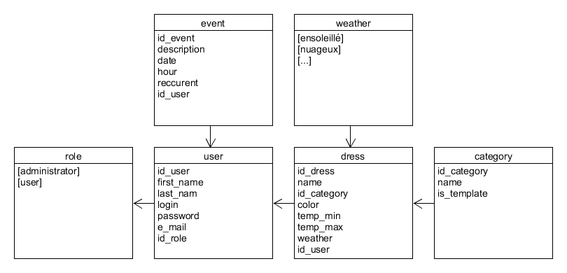

# Documentation technique

Projet ***Wearther***, par *Myaz Aliya*, TPI 2021

## Table des matières

[TOC]

## Table des versions

| N° de version | Date       | Auteur     | Changements apportés                            |
| ------------- | ---------- | ---------- | ----------------------------------------------- |
| 1.0           | 20.05.2021 | Aliya Myaz | Version finale du document pour le rendu du TPI |

## Introduction

Le projet ***Wearther*** est une application web qui propose des suggestions de tenues en fonction de la météo. Son but est de faire gagner du temps aux utilisateurs, voir de les sauver les jours où leur réveil ne sonne pas. L'application permet, en un clic, d'avoir un aperçu sur la météo du jour et de la semaine à venir, une suggestion de tenue journalière adaptée à la météo, et une vue sur leur agenda du jour, le tout sur la même page. En effet, pour être la plus pratique possible, l'application dispose également d'un calendrier et d'un semainier.

J'ai réalisé ce projet en PHP avec une base de donnée MySQL. J'ai également fait appel à une API externe, *OpenWeatherMap*, pour la météo.

## Rappel de l'énoncé

### Objectif

[Description fonctionnelle de l'application - liste fonctionnalités énoncé]

### Organisation

[Temporalité et méthodologie]

### Livrables

[Quoi ? A qui ?]

### Matériel et logiciels nécessaires

[Blabla]

## Etude d'opportunité

### Pourquoi ce sujet ?

[Blabla]

### Ce que mon projet a de plus

[Regroupe une grande partie des informations nécessaires à une personne pour se préparer à sa journée]

### Description de ce qui existe déjà

[Sites météo ordinaires, organisateurs de temps]

## Méthodologie

### Planification en six étapes

#### 1. S'informer

J'ai commencé par lire attentivement mon énoncé afin d'en ressortir tout ce qui était nécessaire à la réalisation de mon projet, et ai demandé des précisions à mon formateur. J'ai également fait des recherches sur l'API météo que je pourrais utiliser pour mon projet.

#### 2. Planifier

Ensuite, je me suis directement attaquée au planning, sous forme de diagramme de GANTT, dans le but d'être organisée dès le début et d'optimiser mon temps. Cela m'a aussi permis de clarifié toutes les tâches et sous-tâches que je devais réaliser pour mener mon projet jusqu'au bout. 

Je me suis appuyée dessus pour faire, juste après, le product backlog avec des user stories, en définir ainsi clairement, du côté de l'utilisateur de mon site, les fonctionnalités à implémenter.

Pour chaque story, j’ai fixé une priorité, grâce à la méthode MoSCoW, pour être plus efficace dans ma manière de travailler. Voici la notation de cette méthode :

M : Must

S : Should

C : Could

W : Won't

J'ai également ajouté ce caractère :

!  : Bloquant

#### 3. Décider

Dans chaque partie de mon travail, j'ai dû faire des choix, notamment quant au calendrier, dont les instructions étaient plutôt libres, mais aussi des choix quand aux limites de mon travail. En effet, ayant souvent tendance à vouloir faire plus, j'ai du me restreindre de manière à répondre correctement aux objectifs explicitement donnés, dans le temps donné. J'explique dans le journal de bord les différentes décisions que j'ai pris.

#### 4. Réaliser

J'ai donc pu, grâce aux étapes précédentes, implémenter mon travail de manière organisée et réfléchie.

#### 5. Contrôler

J'avais commencé par mettre, dans le planning, tous mes tests à la fin, avant de réaliser que je devais tester chaque fonctionnalité après l'avoir terminée, d'autant plus que les tests étaient déjà créés dès le début à cet effet. J'ai donc effectué tous les tests de chaque fonctionnalité après l'avoir terminée, ainsi que tous les tests des fonctionnalités précédemment réalisées et testées, pour vérifier qu'il n'y ait pas de régression. Un tableau, dans ma documentation, me permet de suivre l'évolution de mes fonctionnalités terminées, en visualisant les tests fonctionnels. Ensuite, je suis allée au-delà des tests et ai essayé d'utiliser "mal" mon programme afin de m'assurer qu'il ne possédait pas de failles.

#### 6. Évaluer

Les bilans de la journée que j'ai écrit après chaque journée de travail m'ont permis, à la fin, de me rendre compte de ma manière de travailler, et d'évoluer. Les plannings prévisionnels et effectifs m'ont également été utiles pour constater la manière de travailler qui me convenait réellement. J'ai donc rédigé un bilan personnel dans ma conclusion, afin de rendre compte de mes constatations et ressentis.

### Développement agile

[Expliquer backlog]

## Planification

### Product backlog

#### Utilisateurs

| Nom                       | S1 : Inscription                                             |
| ------------------------- | ------------------------------------------------------------ |
| *Description (user story) | En tant qu'utilisateur non connecté, je peux créer un compte, en indiquant mon nom, prénom, pseudo, adresse maile et mot de passe. |
| *Critère d'acceptation*   | Le test 1.1 passe                                            |
| *Priorité*                | ! M                                                          |

| Nom                        | S2 : Connexion                                               |
| -------------------------- | ------------------------------------------------------------ |
| *Description (user story)* | En tant qu'utilisateur non connecté, je peux me connecter en entrant mon pseudo et mon mot de passe. |
| *Critère d'acceptation*    | Les tests 1.2 à 1.5 passent                                  |
| *Priorité*                 | ! M                                                          |

| Nom                        | S3 : Déconnexion                                             |
| -------------------------- | ------------------------------------------------------------ |
| *Description (user story)* | En tant qu'utilisateur connecté, je peux cliquer sur un bouton pour me déconnecter. |
| *Critère d'acceptation*    | Le test 1.6 passe                                            |
| *Priorité*                 | M                                                            |

| Nom                        | S4 : Supprimer un utilisateur                                |
| -------------------------- | ------------------------------------------------------------ |
| *Description (user story)* | En tant qu'administrateur connecté, je peux supprimer un utilisateur sélectionné dans une liste. |
| *Critère d'acceptation*    | Les tests 1.8 à 1.9 passent                                  |
| *Priorité*                 | S                                                            |

| Nom                        | S5 : Modifier le compte                                      |
| -------------------------- | ------------------------------------------------------------ |
| *Description (user story)* | En tant qu'utilisateur connecté, je peux modifier chacune des informations liées à mon compte. |
| *Critère d'acceptation*    | Le test 1.7 passe                                            |
| *Priorité*                 | S                                                            |

#### Météo

| Nom                        | S6 : Afficher la météo détaillée                             |
| -------------------------- | ------------------------------------------------------------ |
| *Description (user story)* | En tant qu'utilisateur connecté, je peux visualiser, pour un jour sélectionné parmi les 5 prochains, les détails météo enregistrés toutes les trois heures |
| *Critère d'acceptation*    | Le test 2.1 passe                                            |
| *Priorité*                 | M                                                            |

| Nom                        | S7 : Afficher la météo résumée                               |
| -------------------------- | ------------------------------------------------------------ |
| *Description (user story)* | En tant qu'utilisateur connecté, je peux visualiser, dans mon calendrier, pour les trois prochains jours, la température et l'état d'ensoleillement. |
| *Critère d'acceptation*    | Le test 2.2 passe                                            |
| *Priorité*                 | S                                                            |

#### Calendrier 

| Nom                        | S8 : Afficher le calendrier                                  |
| -------------------------- | ------------------------------------------------------------ |
| *Description (user story)* | En tant qu'utilisateur connecté, je peux visualiser mon calendrier, mois par mois, avec ses évènements, ainsi que la météo sur les trois jours à venir. |
| *Critère d'acceptation*    | Les tests 2.2, 3.1 et 3.3 passent                            |
| *Priorité*                 | M                                                            |

| Nom                        | S9 : Afficher le semainier                                   |
| -------------------------- | ------------------------------------------------------------ |
| *Description (user story)* | En tant qu'utilisateur connecté, je peux visualiser mon semainier, contenant tous les évènements hebdomadaires que j'ai ajouté. |
| *Critère d'acceptation*    | Les tests 3.2 à 3.3 passent                                  |
| *Priorité*                 | M                                                            |

| Nom                        | S10 : Ajouter un évènement                                   |
| -------------------------- | ------------------------------------------------------------ |
| *Description (user story)* | En tant qu'utilisateur connecté, je peux remplir un formulaire contenant une description de l'évènement ainsi que sa date et son heure, ainsi qu'une case à cocher définissant si c'est un évènement hebdomadaire ou unique. |
| *Critère d'acceptation*    | Les tests 3.3 à 3.4 passent                                  |
| *Priorité*                 | M                                                            |

| Nom                        | S11 : Afficher un évènement                                  |
| -------------------------- | ------------------------------------------------------------ |
| *Description (user story)* | En tant qu'utilisateur connecté, je peux, en sélectionnant un jour parmi les 5 jours à venir, afficher les évènements assignés à cette date et ce jour de la semaine. |
| *Critère d'acceptation*    | Les tests 3.5 à 3.6 passent                                  |
| *Priorité*                 | S                                                            |

#### Vêtements

| Nom                        | S12 : Ajouter un vêtement                                    |
| -------------------------- | ------------------------------------------------------------ |
| *Description (user story)* | En tant qu'utilisateur connecté, je peux ajouter un vêtement à ma garde-robe en replissant un formulaire, qui indique son type et sa couleur, ainsi que la catégorie météo et intervalle de température dans lequel il peut être porté. |
| *Critère d'acceptation*    | Le test 4.1 passe                                            |
| *Priorité*                 | M                                                            |

| Nom                        | S13 : Afficher les vêtements                                 |
| -------------------------- | ------------------------------------------------------------ |
| *Description (user story)* | En tant qu'utilisateurs connecté, je peux visualiser l'image d'un vêtement que j'ai créé, qui est un fichier SVG généré grâce au type et à la couleur du vêtement. |
| *Critère d'acceptation*    | Le test 4.2 passe                                            |
| *Priorité*                 | S                                                            |

| Nom                        | S14 : Afficher une recommandation de tenue                   |
| -------------------------- | ------------------------------------------------------------ |
| *Description (user story)* | En tant qu'utilisateur connecté, je peux visualiser, pour chaque jour sélectionné parmi les 5 à venir, une tenue adaptée à la météo prévue. |
| *Critère d'acceptation*    | Les tests 4.2 à 4.3 passent                                  |
| *Priorité*                 | M                                                            |

### Planification prévue

[Graphique]

### Planification effective

[Blabla évolution entre les graphiques]

[Graphique]

## Analyse Fonctionnelle

### Fonctionnalités du projet

[Lister les fonctionnalités]

### Description détaillée de la liste des fonctionnalités

[Expliquer les fonctionnalités]

### Description de l’interface

[maquettes (Figma) commentées]

## Analyse organique

### Technologies utilisées et environnement

[Programmation en CSS, projet de type WidowsForm.

Développement sur Visual Studio, réalisation des diagrammes sur Umlet, maquettes sur Figma, documentation sur Typora.]

[Langages et versions]

### Description globale de l’architecture du projet

[Diagramme de classe simplifié + capture d'écran de l'architecture]

### Base de données

[Présentation]

#### MLD

### API externe (météo)

[Présenter l'API]

### Classes PHP

#### Week

Description du rôle

**Méthodes :**

*ExempleMethode* : Description de la méthode

#### Day

Description du rôle

**Méthodes :**

*ExempleMethode* : Description de la méthode

#### MeteoRecord

Description du rôle

**Méthodes :**

*ExempleMethode* : Description de la méthode

### Argumentation des choix de méthodes de résolution

[Choix de l'API météo]

[Choix de la réalisation du calendrier]

[Choix des images en fichiers SVG]

### Pseudo code ou des structogrammes

[Structogramme . algorithme de recommandation de vêtements]

## Tests et protocole de tests

### Périmètre des tests

[]

### Environnement de test

[]

### Scénarios de test

Les scénarios ont été écrits avant la réalisation du projet, afin de garantir la réponse aux demandes du cahier des charge. Lors de la réalisation d'un scénario, faire attention à ce que son scénario prérequis ait été exécuté avant. Dans le cadre de ce travail, les tests ont été exécutés manuellement.

#### Scénarios - gestion des utilisateurs

| Nom                 | 1.1 Inscription                                              |
| ------------------- | ------------------------------------------------------------ |
| *User story*        | S1 : Inscription                                             |
| *Situation*         | Je suis déconnecté ; Je clique sur *"Connexion"* dans la navigation de la page principale ; en-dessous du formulaire de connexion, je clique sur "*je n'ai pas encore de compte*" ; j'entre les valeurs de test suivantes dans le formulaire : "**Nom**" : "*NomTest*" - "**Prénom**" : "PrenomTest" - "**Mail**" : "*test@gmail.com*" - "**Pseudo**" : "*PseudoTest*", "**Mot-de-passe**" : "*abc*"; Je clique sur "*valider*" ➔ Je suis redirigé vers la page principale, déconnecté. |
| *Résultats obtenus* |                                                              |
| *Statut*            | X                                                            |

| Nom                 | 1.2 Connexion utilisateur (prérequis : scénario 1.1)         |
| ------------------- | ------------------------------------------------------------ |
| *User story*        | S2 : Connexion                                               |
| *Situation*         | Je suis déconnecté ; Je clique sur *"Connexion"* dans la navigation de la page principale ; J'entre les valeurs suivantes dans le formulaire : "**Pseudo**" : "*pseudoTest*" - "**Mot de passe**" : "*abc*"; Je clique sur "*valider*" ➔ Alors, je suis redirigé vers la page principale, connecté. Dans la barre de navigation, je vois le le bouton "*Déconnexion*". Des liens menant vers le calendrier, le semainier, la garde-robe et l'ajout de vêtements sont apparus. |
| *Résultats obtenus* |                                                              |
| *Statut*            | X                                                            |

| Nom                 | 1.3 Connexion administrateur                                 |
| ------------------- | ------------------------------------------------------------ |
| *User story*        | S2 : Connexion                                               |
| *Situation          | Etant donné que le compte administrateur existe déjà par défaut ; Je clique sur *"Connexion"* dans la navigation de la page principale ; J'entre les valeurs suivantes dans le formulaire : "**Pseudo**" : "SuperAdmin" - "**Mot de passe**" : "*abcd*"; Je clique sur "*valider*" ➔ Je suis redirigé vers la page principale, connecté. Dans la barre de navigation, je vois le le bouton "*Déconnexion*" et le lien "*Gestion des utilisateurs*". |
| *Résultats obtenus* |                                                              |
| *Statut*            | X                                                            |

| Nom                 | 1.4 Refus de la connexion mot de passe erroné                |
| ------------------- | ------------------------------------------------------------ |
| *User story*        | S2 : Connexion                                               |
| *Situation*         | Je suis déconnecté ; Je n'ai pas créé de compte ; Je clique sur *"Connexion"* dans la navigation de la page principale ; J'entre les valeurs suivantes dans le formulaire : "**Pseudo**" : "*pseudoTest*" - "**Mot de passe**" : "*abcd*"; Je clique sur "*valider*" ➔ Je reçois un message d'erreur m'indiquant que le nom d'utilisateur ou le mot de passe est erroné. |
| *Résultats obtenus* |                                                              |
| *Statut*            | X                                                            |

| Nom                 | 1.5 Refus de la connexion utilisateur inexistant             |
| ------------------- | ------------------------------------------------------------ |
| *User story*        | S2 : Connexion                                               |
| *Situation*         | Je suis déconnecté ; Je n'ai pas créé de compte ; Je clique sur *"Connexion"* dans la navigation de la page principale ; J'entre les valeurs suivantes dans le formulaire : "**Pseudo**" : "*pseudoInexistant*" - "**Mot de passe**" : "*abcd" ; Je clique sur "*valider*" ➔ Je reçois un message d'erreur m'indiquant que le nom d'utilisateur ou le mot de passe est erroné. |
| *Résultats obtenus* |                                                              |
| *Statut*            | X                                                            |

| Nom                 | 1.6 Déconnexion                                              |
| ------------------- | ------------------------------------------------------------ |
| *User story*        | S3 : Déconnexion                                             |
| *Situation*         | Je suis connecté en tant qu'utilisateur (scénario 1.2) ; Je clique sur *"Déconnexion"* dans la navigation de la page principale ;  ➔ Je suis redirigé vers la page principale, déconnecté. Seuls le bouton "Connexion" est affiché dans la navigation. |
| *Résultats obtenus* |                                                              |
| *Statut*            | X                                                            |

| Nom                 | 1.7 Modifier le compte                                       |
| ------------------- | ------------------------------------------------------------ |
| *User story*        | S5 : Modifier le compte                                      |
| *Situation*         | Je suis connecté en tant qu'utilisateur (scénario 1.2) ; Je clique sur *"Mon compte"* dans la navigation de la page principale ; sur la page "*Mon compte*" ; Je modifie le champs "**Mail**" par "*nouveau@gmail.com*" ; Je clique sur "*Valider*" ; Je clique sur "*Home*" ; Je re-clique sur *"Mon compte"* ➔ Le champs "**Mail**" contient : "*nouveau@gmail.com*"; |
| *Résultats obtenus* |                                                              |
| *Statut*            | X                                                            |

| Nom                 | 1.8 Voir les utilisateurs                                    |
| ------------------- | ------------------------------------------------------------ |
| *User story*        | S4 : Supprimer un utilisateur                                |
| *Situation*         | Je suis connecté en tant qu'administrateur ; Je clique sur "*Gestion des utilisateurs*" dans la navigation de la page principale ➔ Alors, je suis redirigé vers la page de gestion des utilisateurs, qui affiche la liste des comptes utilisateurs. |
| *Résultats obtenus* |                                                              |
| *Statut*            | X                                                            |

| Nom                 | 1.9 Supprimer un utilisateur                                 |
| ------------------- | ------------------------------------------------------------ |
| *User story*        | S4 : Supprimer un utilisateur                                |
| *Situation*         | Je suis connecté en tant qu'administrateur (scénario 1.3) ; Je clique sur la case à cocher de l'utilisateur *"PseudoTest"* dans la liste de la page "*Gestion des utilisateurs*"  (scénario 1.8);  Je clique sur "*Supprimer*"➔ La page est actualisée et l'utilisateur *"PseudoTest"* n'est plus dans la liste. |
| *Résultats obtenus* |                                                              |
| *Statut*            | X                                                            |

#### Scénarios  - gestion de la météo

| Nom                 | 2.1 Afficher météo détaillée                                 |
| ------------------- | ------------------------------------------------------------ |
| *User story*        | S6 : Afficher la météo détaillée                             |
| *Situation*         | Je suis connecté en tant qu'administrateur ; Je clique sur la case à cocher de l'utilisateur *"PseudoTest"* dans la liste de la page "*Gestion des utilisateurs*" ;  Je clique sur "*Supprimer*"➔ La page est actualisée et l'utilisateur *"PseudoTest"* n'est plus dans la liste. |
| *Résultats obtenus* |                                                              |
| *Statut*            | X                                                            |

| Nom                 | 2.2 Afficher la météo résumée                                |
| ------------------- | ------------------------------------------------------------ |
| *User story*        | S7 : Afficher la météo résumée                               |
| *Situation*         | Je suis connecté en tant qu'utilisateur; Je clique sur "*Calendrier*"  depuis la page principale ;  ➔ Je peux voir, pour le jour actuel et des deux suivants, la température et le niveau d'ensoleillement. |
| *Résultats obtenus* |                                                              |
| *Statut*            | X                                                            |

//A faire plus tard : pareil pour les deux, mais avec des données de test.

#### Scénarios  - gestion du calendrier- à faire

| Nom                 | 3.1 Afficher le calendrier                                   |
| ------------------- | ------------------------------------------------------------ |
| *User story*        | S8 : Afficher le calendrier                                  |
| *Situation*         | Je suis connecté en tant qu'utilisateur ; Je clique sur "*Calendrier*"  depuis la page principale ;  ➔ La page apparaît avec un calendrier, dont le mois affiché est le mois actuel. Le nombre de jours du mois (Mai = 31) est correct.  Les jour de la semaine du jour actuel est correct. |
| *Résultats obtenus* |                                                              |
| *Statut*            | X                                                            |

| Nom                 | 3.2 Afficher le semainier                                    |
| ------------------- | ------------------------------------------------------------ |
| *User story*        | S9 : Afficher le semainier                                   |
| *Situation*         | Je suis connecté en tant qu'utilisateur; Je clique sur "*Calendrier*"  depuis la page principale ;  ➔ La page apparaît avec un semainier (lundi-dimanche). |
| *Résultats obtenus* |                                                              |
| *Statut*            | X                                                            |

| Nom                 | 3.3 Ajouter un évènement au calendrier |
| ------------------- | -------------------------------------- |
| *User story*        | S10 : Ajouter un évènement             |
| *Situation*         | [A faire]                              |
| *Résultats obtenus* |                                        |
| *Statut*            | X                                      |

| Nom                 | 3.4 Ajouter un évènement au semainier |
| ------------------- | ------------------------------------- |
| *User story*        | S10 : Ajouter un évènement            |
| *Situation*         | [A faire]                             |
| *Résultats obtenus* |                                       |
| *Statut*            | X                                     |

| Nom                 | 3.5 Afficher les évènements uniques pour un jour (prérequis : 3.3) |
| ------------------- | ------------------------------------------------------------ |
| *User story*        | S11 : Afficher un évènement                                  |
| *Situation*         | Je suis connecté en tant qu'utilisateur ; Je clique sur "*>*"  (jour suivant) sur la page principale ➔ La page apparaît avec le jour suivant (si on est mercredi -> jeudi). Je vois l'évènement nommé "Anniversaire ", assigné à l'heure : "*20:00*". |
| *Résultats obtenus* |                                                              |
| *Statut*            | X                                                            |

| Nom                 | 3.6 Afficher les évènements hebdomadaires pour un jour (prérequis : 3.4) |
| ------------------- | ------------------------------------------------------------ |
| *User story*        | S11 : Afficher un évènement                                  |
| *Situation*         | Je suis connecté en tant qu'utilisateur ; Je clique sur "*>*"  (jour suivant) sur la page principale ➔ La page apparaît avec le jour suivant (si on est mercredi -> jeudi). Je vois l'évènement nommé "Sport", assigné à l'heure : "*18:00*". |
| *Résultats obtenus* |                                                              |
| *Statut*            | X                                                            |

#### Scénarios - gestion de la garde-robe

[Nom ; Type ; Couleur ; Catégorie météo ; Intervalle temp]

["Pull vert préféré" ;  "Pull" ;  "\#F08080" ;  "Neige" ;  "-10;5"]

| Nom                 | 4.1 Ajouter un vêtement                                      |
| ------------------- | ------------------------------------------------------------ |
| *User story*        | S12 : Ajouter un vêtement                                    |
| *Situation*         | Je suis connecté en tant qu'utilisateur ; Je clique sur "*Nouveau vêtement*" sur la page principale ;  Je remplis le formulaire avec les données de test ci-dessus ; J'appuie sur "*valider*" ➔ Je suis redirigé vers ma garde-robe. Je peux y voir, dans la catégorie "*Pulls*", le titre de mon vêtement : "*Pull vert préféré*". |
| *Résultats obtenus* |                                                              |
| *Statut*            | X                                                            |

| Nom                 | 4.2 Afficher l'image d'un vêtement (prérequis : scénario 4.1) |
| ------------------- | ------------------------------------------------------------ |
| *User story*        | S13 : Afficher les vêtements                                 |
| *Situation*         | Je suis connecté en tant qu'utilisateur ; Je clique sur "*Ma garde-robe*" sur la page principale ; ➔ Je suis redirigé vers ma garde-robe. Je peux y voir l'image d'un pull rouge. |
| *Résultats obtenus* |                                                              |
| *Statut*            | X                                                            |

[Nom ; Type ; Couleur ; Catégorie météo ; Intervalle temp]

[  ;  ;  ;  ;  ]

| Nom                 | 4.3 Afficher un tenue adaptée à la météo                     |
| ------------------- | ------------------------------------------------------------ |
| *User story*        | S14 : Afficher une recommandation de tenue                   |
| *Situation*         | Je suis connecté en tant qu'utilisateur ; J'ai ajouté les données de test ci-dessus ; Je clique sur "*>*"  (jour suivant) sur la page principale ➔ Sur la page du jour, une tenue comprenant un haut, un bas et des chaussures au minimum est affiché. La tenue est adaptée à la météo affichée : la température et l'ensoleillement affiché est compris dans les intervalles de température et catégories météo de chaque vêtement. |
| *Résultats obtenus* |                                                              |
| *Statut*            | X                                                            |

### Evolution des tests

| N° test | J0 - 03.05 | J1 - 04.05 | J2 - 05.05 | J3- 06.05 | J4- 10.05 | J5- 11.05 | J6- 12.05 | J7- 17.05 | J8- 18.05 | J9- 18.05 | J10- 29.05 |
| ------- | ---------- | ---------- | ---------- | --------- | --------- | --------- | --------- | --------- | --------- | --------- | ---------- |
| 1.1     | ✗          | ✗          | ✓          | ✓         | ✓         | ✓         | ✓         | ✓         | ✓         | ✓         | ✓          |
| 1.2     | ✗          | ✗          | ✓          | ✓         | ✓         | ✓         | ✓         | ✓         | ✓         | ✓         | ✓          |
| 1.3     | ✗          | ✗          | ✓          | ✓         | ✓         | ✓         | ✓         | ✓         | ✓         | ✓         | ✓          |
| 1.4     | ✗          | ✗          | ✓          | ✓         | ✓         | ✓         | ✓         | ✓         | ✓         | ✓         | ✓          |
| 1.5     | ✗          | ✗          | ✓          | ✓         | ✓         | ✓         | ✓         | ✓         | ✓         | ✓         | ✓          |
| 1.6     | ✗          | ✗          | ✓          | ✓         | ✓         | ✓         | ✓         | ✓         | ✓         | ✓         | ✓          |
| 1.7     | ✗          | ✗          | ✓          | ✓         | ✓         | ✓         | ✓         | ✓         | ✓         | ✓         | ✓          |
| 1.8     | ✗          | ✗          | ✓          | ✓         | ✓         | ✓         | ✓         | ✓         | ✓         | ✓         | ✓          |
| 1.9     | ✗          | ✗          | ✓          | ✓         | ✓         | ✓         | ✓         | ✓         | ✓         | ✓         | ✓          |
| 2.1     | ✗          | ✗          | ✗          |           |           |           | ✓         | ✓         | ✓         | ✓         | ✓          |
| 2.2     | ✗          | ✗          | ✗          |           |           |           | ✓         | ✓         | ✓         | ✓         | ✓          |
| 3.1     | ✗          | ✗          | ✗          |           |           |           | ✓         | ✓         | ✓         | ✓         | ✓          |
| 3.2     | ✗          | ✗          | ✗          |           |           |           | ✓         | ✓         | ✓         | ✓         | ✓          |
| 3.3     | ✗          | ✗          | ✗          |           |           |           | ✓         | ✓         | ✓         | ✓         | ✓          |
| 3.4     | ✗          | ✗          | ✗          |           |           |           | ✗         | ✓         | ✓         | ✓         | ✓          |
| 3.5     | ✗          | ✗          | ✗          |           |           |           | ✓         | ✓         | ✓         | ✓         | ✓          |
| 3.6     | ✗          | ✗          | ✗          |           |           |           | ✗         | ✓         | ✓         | ✓         | ✓          |
| 4.1     | ✗          | ✗          | ✗          |           |           |           | ✓         | ✓         | ✓         | ✓         | ✓          |
| 4.2     | ✗          | ✗          | ✗          |           |           |           | ✓         | ✓         | ✓         | ✓         | ✓          |
| 4.3     | ✗          | ✗          | ✗          |           |           |           | ✓         | ✓         | ✓         | ✓         | ✓          |

J3 : Calendrier partiellement ok
J4 : Météo ok partiellement
J5 : Météo ok
J6 : tout ok ?

## Conclusion

### Améliorations possibles

***[Titre amélioration]***

Description améliorations

[Idées : gestion de l'alimentation pour que ce soit encore plus complet, machines si ce n'est pas déjà fait dans le TPI]

### Difficultés rencontrées

[Blabla]

### Bilan personnel

[Bilan]

### Remerciements

[Remerciements]

## Bibliographie

### API Météo

https://openweathermap.org/forecast5

### Graphiques

https://developers.google.com/chart/interactive/docs

### Affichage

[liens]

### Autres

[liens]