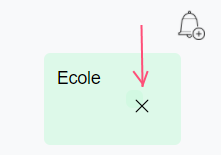
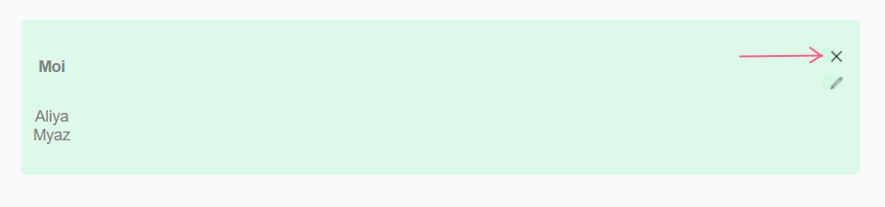

# Wearther - Manuel d'utilisateur

[TOC]

## Introduction

L'application ***Wearther*** est un système de recommandations de tenues journalières, se basant sur la météo et la garde-robe de l'utilisateur. Une fois, inscrit et connecté, il est possible d'y enregistrer ses vêtement et de visualiser les propositions sur les 5 jours à venir. Le site comporte également un calendrier et un semainier qui permettent d'avoir une vue d'ensemble des évènements de ces jours à venir 

Ce projet a ainsi pour but d'éviter de perdre du temps à rechercher une tenue.

## Démarrer
### Rôles

La barre de navigation, la page d'accueil et les fonctionnalités disponibles diffèrent en fonction de l'utilisateur. Le site gère les trois rôles ci-dessous, avec les spécificités suivantes :

#### Visiteur

Le *visiteur* est tout utilisateur non connecté. Les seules fonctionnalités auxquelles il peut accéder sont la connexion et l'inscription.

#### Utilisateur

L'*utilisateur* est un utilisateur normal connecté. Il bénéficie des fonctionnalités principales de l'application, qui sont l'accès à la météo, la recommandation de tenues, la gestion de la garde-robe, le calendrier et le semainier. Il peut également modifier son compte.

#### Administrateur

L'*administrateur* est un utilisateur particulier dont le rôle est de gérer les utilisateurs. Il peut donc créer, modifier et supprimer des utilisateurs.

### Se connecter

L'utilisateur et l'administrateur doivent donc, pour accéder aux fonctionnalités, se connecter à leur compte.

#### En tant qu'utilisateur

1. Depuis la page principale, cliquer sur ***Inscription***
2. Remplir le formulaire d'inscription, puis cliquer sur ***Valider***
3. Depuis la page principale, cliquer sur ***Connexion***
4. Remplir le formulaire avec le nom d'utilisateur et le mot de passe entrés durant l'inscription
5. Valider le formulaire

Figure 1.1 - Inscription à l'application

Figure 1.2 - Connexion à l'application

#### En tant qu'administrateur

1. Depuis la page principale, cliquer sur ***Connexion*** (Figure 1.2)
2. Remplir le formulaire avec le nom d'utilisateur et mot de passe suivants *"Admin"* et *"1234"
3. Valider le formulaire

### Se déconnecter

Une fois connecté en tant qu'utilisateur ou administrateur, vous pouvez vous déconnecter de la manière suivante :

1. Sur la page d'accueil, cliquer sur le bouton de déconnexion

Figure 1.3 - Déconnexion de l'application

## Présentation de l'interface

Voici les pages principales de l'application, accessibles depuis un compte utilisateur :

***Page d'accueil*** : Affiche, pour une journée parmi les 5 à venir, la météo tout au long de la journée, une recommandations de tenue adaptée à la tenue, ainsi que les activités et évènements. Navigation entre ces jours.

Figure 2.1 - Page principale

***Page de gestion de la garde-robe*** : Affiche les vêtements ajoutés par l'utilisateur, avec des contrôles permettant de les modifier et de les supprimer.

Figure 2.2 - Page de gestion de la garde-robe

***Calendrier*** : Calendrier classique affichant les évènements ajoutés par l'utilisateur, ainsi que la météo du matin et du soir pour les trois jours à venir. Navigation de mois en mois.

Figure 2.3 - Calendrier

***Semainier*** : Semainier affichant, pour chaque jour de la semaine, de 6h à 22h, les activités hebdomadaires enregistrées par les utilisateurs.

Figure 2.4 - Semainier

## Fonctionnement

### Je suis un utilisateur

En tant qu'utilisateur connecté, vous avez accès aux fonctionnalités suivantes :

#### Modifier son compte

1. Depuis la page d'accueil, cliquer sur le bouton de gestion de compte (Figure 3.1)

2. Modifier les informations voulues dans le formulaire

3. Valider le formulaire

   

   

   Figure 3.1 - Gestion du compte

   

#### Supprimer son compte

1. Depuis la page d'accueil, cliquer sur le bouton de gestion de compte (Figure 3.1)
2. Cliquer sur le bouton "Supprimer mon compte"

#### Afficher les informations d'une journée

1. Depuis la page principale, dans la navigation horizontale, cliquer sur le jour à afficher (Figure 3.4)

Figure 3.2 - Affichage de la météo d'un jour sélectionné

#### Afficher la météo détaillée d'une heure de la journée

1. Depuis la page principale, dans la navigation horizontale, cliquer sur le jour à afficher (Figure 3.4)
2. Dans l'affichage des informations de la journée, cliquer sur l'heure dont les informations doivent être affichées

Figure 3.3 - Affichage de la météo détaillées d'une heure sélectionnée

#### Afficher un mois du calendrier

1. Depuis la page principale, cliquer sur le bouton "***Calendrier***" (Figure 3.6)
2. Utiliser la navigation dans la barre horizontale pour se déplacer de mois en mois (Figure 3.7)

Figure 3.4 - Affichage du calendrier

Figure 3.5 - Navigation entre les mois du calendrier

#### Ajouter un évènement au calendrier

1. Depuis la page principale, cliquer sur le bouton "***Calendrier***" (Figure 3.6)
2. Cliquer sur le bouton "***Nouvel évènement***" (Figure 3.8)
3. Remplir le formulaire et le valider

Figure 3.6 - Affichage du calendrier

#### Supprimer une activité du calendrier

1. Depuis la page principale, cliquer sur le bouton "***Calendrier***"
2. Cliquer sur le bouton "**X**" de l'évènement à supprimer

#### Afficher le semainier

1. Depuis la page principale, cliquer sur le bouton "***Semainier***"

   

Figure 3.7 - Affichage du semainier

#### Ajouter une activité au semainier

1. Depuis la page principale, cliquer sur le bouton "***Semainier***"

2. Cliquer sur le bouton avec la cloche de l'heure et du jour de l'activité

3. Remplir le formulaire et le valider

   

Figure 3.8 - Ajout d'une activité au semainier

#### Supprimer une activité du semainier

1. Depuis la page principale, cliquer sur le bouton "***Semainier***"

2. Cliquer sur le bouton "**X**" de l'évènement à supprimer

   
   
   
   
   Figure 3.9 - Suppression d'une activité du semainier
   
   

#### Afficher tous les vêtements de la garde-robe

1. Depuis la page principale, cliquer sur le bouton "***Voir ma garder-robe***"

#### Ajouter un vêtement à la  garde-robe

1. Depuis la page principale, cliquer sur le bouton "***Ajouter un vêtement***"

2. Remplir le formulaire et le valider

   

#### Modifier un vêtement

1. Depuis la page principale, cliquer sur le bouton "***Voir ma garder-robe***"
2. Cliquer sur bouton de modification du vêtement à modifier
3. Modifier dans le formulaire les informations qui doivent être modifiées
4. Valider le formulaire

Figure 3.10 - Modification d'un vêtement de la garde-robe

#### Supprimer un vêtement

1. Depuis la page principale, cliquer sur le bouton "***Voir ma garder-robe***"
2. Cliquer sur bouton de suppression ("**X**") du vêtement à supprimer

Figure 3.11 - Suppression d'un vêtement de la garde-robe

### Je suis un administrateur

En tant qu'administrateur connecté, vous avez accès aux fonctionnalités suivantes :

#### Afficher la liste des utilisateurs enregistrés

1. Depuis la page principale, cliquer sur le bouton "***Gestion des utilisateurs***"

#### Modifier un utilisateur

1. Depuis la page principale, cliquer sur le bouton "***Gestion des utilisateurs***"

1. Cliquer sur bouton de modification de l'utilisateur à modifier
2. Modifier dans le formulaire les informations qui doivent être modifiées
3. Valider le formulaire

Figure 4.3 - Modification d'un utilisateur par l'administrateur

#### Supprimer un utilisateur

1. Depuis la page principale, cliquer sur le bouton "***Gestion des utilisateurs***"
2. Cliquer sur bouton de suppression ("**X**") de l'utilisateur à supprimer

Figure 4.3 - Suppression d'un utilisateur par l'administrateur

#### Ajouter un utilisateur

1. Depuis la page principale, cliquer sur le bouton "***Gestion des utilisateurs***"
1. Dans la barre de navigation secondaire, cliquer sur bouton d'ajout d'utilisateur dans la navigation
3. Remplir et valider le formulaire

Figure 4.3 - Ajout d'un utilisateur  par l'administrateur

## Conclusion

En vous souhaitant une bon démarrage et une excellente expérience sur cette application.

